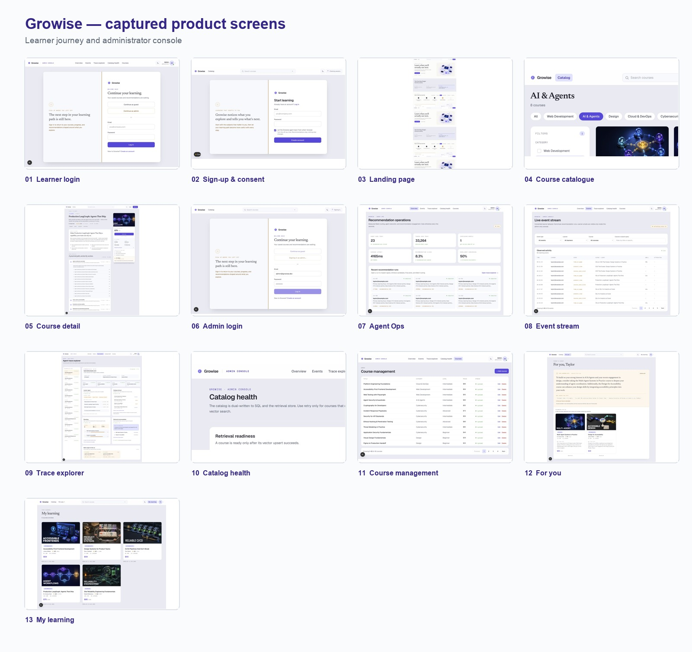
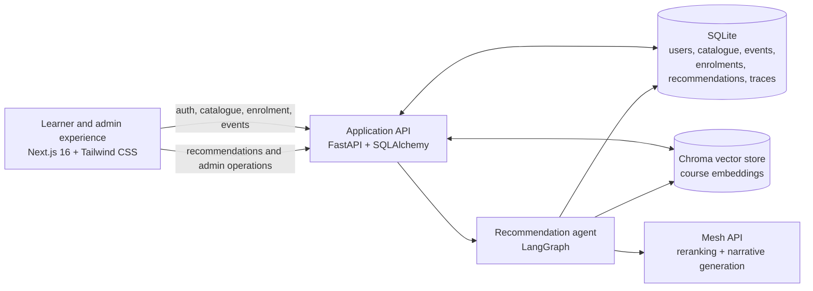
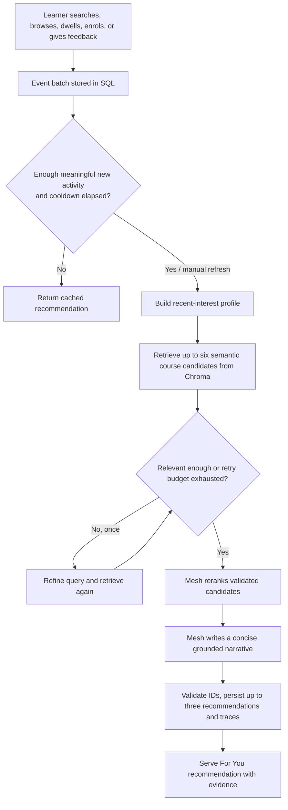

# Growise

**Growise** is an AI-assisted learning marketplace that turns learner behaviour into explainable, course-grounded recommendations. It pairs a polished course discovery experience with an operations console for administrators to manage the catalogue, inspect live signals, and audit every recommendation run.



## The problem

Course marketplaces make it easy to publish a large catalogue, but difficult for learners to decide what to take next. A static “related courses” section usually ignores the learner’s current intent, prior browsing, enrolments, and negative feedback. At the same time, black-box recommendations leave both learners and administrators without a clear explanation of why a course appeared.

## What Growise solves

Growise captures privacy-aware, opt-in product signals—such as searches, course views, course-card clicks, dwell time, enrolment intent, and recommendation feedback—and converts them into a current interest profile. A LangGraph workflow uses that profile to retrieve relevant courses from a vector catalogue, verifies relevance, reranks a small candidate set, and produces a concise explanation tied only to those approved courses.

The result is a recommendation system that is:

- **Personalized:** it responds to recent learner intent rather than using a generic catalogue ordering.
- **Grounded:** the model can only recommend validated course candidates returned from the catalogue.
- **Efficient:** regeneration is gated by meaningful new activity and a cooldown; cached recommendations are reused when appropriate.
- **Traceable:** admins can inspect input signals, retrievals, relevance checks, reranking, model calls, and delivery outcomes.

## Product experience

| Area | What users can do |
| --- | --- |
| Learner landing page | Understand the product, browse highlighted courses, and start exploring. |
| Course catalogue | Search, filter by category and level, and compare course cards. |
| Course detail | Review outcomes and curriculum, enrol, and generate high-quality interest signals. |
| Authentication | Create an account with explicit tracking consent or sign in to continue learning. |
| For You | View a personalized recommendation, its supporting evidence, and dismiss irrelevant suggestions. |
| My Learning | Return to enrolled courses from one place. |
| Admin console | Manage courses, monitor catalogue-vector sync health, inspect live events, and audit agent traces. |

## Architecture



### Frontend

The Next.js application provides public discovery, authenticated learner pages, and protected admin views. A browser tracker queues consented interaction events and sends them to the backend every five seconds or when the queue reaches 20 events. On page hide or unload, it uses a keepalive request so useful signals are less likely to be lost.

### API and transactional data

FastAPI exposes JWT-protected endpoints for authentication, products, enrolments, event ingestion, recommendations, and administrator operations. SQLAlchemy persists the system of record: users, courses, behaviour events, enrolments, recommendation results, agent runs, step traces, and Mesh-call telemetry.

### Vector catalogue and dual-write consistency

Every course has a normal relational record and a semantic representation in Chroma. Product creation and updates commit the database record first, then synchronise the course document and metadata to the vector collection. If vector synchronisation fails, the course is marked as pending instead of silently disappearing from operational visibility; the Catalog Health screen lets an admin retry outstanding syncs.

### Recommendation agent

LangGraph orchestrates the decision flow. The agent first evaluates whether the learner has enough meaningful new activity to justify a fresh recommendation. It then builds an intent profile, retrieves a small semantic candidate set, checks the match quality, optionally refines the query once, reranks candidates through Mesh, and generates an evidence-based narrative. If the reranking model is unavailable, Growise falls back safely to retrieval order. Only course IDs from the validated candidate set may be persisted as recommendations.

### Observability

Each run records the input signal summary, retrieved candidates, relevance decision, refined query when used, final ranking, delivery status, and model-call metadata. The Admin Agent Ops screens turn that telemetry into live events, run summaries, a trace explorer, and catalogue health indicators.

## Recommendation lifecycle



### Signal quality rules

- Meaningful signals include `product_view`, `search`, course-card clicks, enrolment clicks, search-result clicks, and recommendation clicks.
- Dwell time becomes meaningful at 20 seconds or more; longer time contributes more strongly, up to a cap.
- Nearby card-click and product-view duplicates are collapsed within the same short session window.
- Recent activity has more influence than older activity.
- Enrolled courses are excluded, and recently dismissed recommendations are suppressed for 30 days.
- Automatic refreshes require meaningful new activity (default: five events) and respect a default 10-minute cooldown. Manual refresh can bypass the gate when activity exists.

## Technology stack

| Layer | Technology |
| --- | --- |
| Web application | Next.js 16, React, TypeScript, Tailwind CSS |
| API | FastAPI, Pydantic, SQLAlchemy |
| Relational storage | SQLite (development default) |
| Semantic retrieval | Chroma with local sentence embeddings |
| Agent orchestration | LangGraph |
| AI inference | Mesh API (reranking and recommendation narrative) |
| Authentication | JWT bearer tokens with role-based admin access |

## Run locally

### 1. Start the backend

```bash
cd backend
python3 -m venv .venv
source .venv/bin/activate
pip install -r requirements.txt
cp .env.example .env
```

Update `backend/.env` with a valid `MESH_API_KEY`. The default configuration uses a local SQLite database and a local Chroma persistence directory.

```bash
python seed.py
uvicorn app.main:app --reload --port 8000
```

The API will be available at `http://localhost:8000`, with interactive documentation at `http://localhost:8000/docs`.

### 2. Start the frontend

In a second terminal:

```bash
cd frontend
npm install
```

Create `frontend/.env.local`:

```env
NEXT_PUBLIC_API_URL=http://localhost:8000
```

Then run:

```bash
npm run dev
```

Open `http://localhost:3000`.

## Development demo accounts

After running `python seed.py`, use either of these development-only accounts:

| Role | Email | Password |
| --- | --- | --- |
| Learner | `taylor@example.com` | `TaylorPass123` |
| Administrator | `admin@growise.dev` | `AdminPass123` |

Do not use these credentials outside a local development environment.

## API map

| Domain | Representative endpoints |
| --- | --- |
| Authentication | `POST /api/auth/signup`, `POST /api/auth/login`, `GET /api/auth/me` |
| Catalogue | `GET /api/products`, `GET /api/products/{id}`, `GET /api/products/categories` |
| Admin catalogue | `POST/PATCH/DELETE /api/products...` |
| Learning | `GET /api/enrollments/me`, `POST /api/enrollments` |
| Behaviour | `GET /api/events/me`, `POST /api/events/batch` |
| Recommendations | `GET /api/recommendations/me`, `POST /api/recommendations/refresh` |
| Agent operations | `GET /api/admin/agent-ops/overview`, `events`, `runs`, `runs/{run_id}`, and `catalog-health` |

All learner-specific and admin endpoints require a bearer token. Product mutations and Agent Ops endpoints additionally require an administrator role.

## Configuration

| Variable | Purpose |
| --- | --- |
| `DATABASE_URL` | SQLAlchemy connection string; defaults to local SQLite. |
| `CHROMA_PERSIST_DIR` | Local path where Chroma retains course embeddings. |
| `JWT_SECRET` | Secret used to sign access tokens. Use a strong unique value. |
| `ACCESS_TOKEN_EXPIRE_MINUTES` | Access-token lifetime in minutes. |
| `MESH_API_KEY` | API key for Mesh model calls. |
| `MESH_BASE_URL` | Mesh API base URL. |
| `MESH_MODEL` | Model identifier used for reranking and narratives. |
| `CORS_ORIGINS` | Allowed frontend origins for the API. |
| `RECOMMENDATION_MIN_NEW_EVENTS` | Meaningful new-event count needed before automatic regeneration. |
| `RECOMMENDATION_COOLDOWN_MINUTES` | Minimum interval between automatic recommendation runs. |
| `NEXT_PUBLIC_API_URL` | Frontend URL for the FastAPI server. |

## Repository layout

```text
.
├── backend/
│   ├── app/
│   │   ├── agent/          # LangGraph workflow, triggering, tracing
│   │   ├── routers/        # Auth, catalogue, events, recommendations, admin APIs
│   │   ├── services/       # Product and vector-sync services
│   │   └── vector_store.py # Chroma integration
│   └── seed.py             # Development catalogue and demo users
├── frontend/
│   └── src/app/            # Learner and admin Next.js routes
└── docs/                   # Product documentation, PDF, and screen gallery
```

## SmartReco implementation highlights

| Requirement | How Growise addresses it |
| --- | --- |
| FastAPI backend | Typed REST API for the full learner and admin experience. |
| Mesh integration | Mesh is used only where it adds judgment or writing value: reranking and the final narrative. |
| Vector database | Chroma stores semantic course documents and supports intent-based retrieval. |
| Behaviour tracking | Consent-aware, batched browser events capture current learner interest. |
| Agentic workflow | LangGraph handles retrieve, assess, refine, rerank, narrate, and persist stages. |
| Efficiency | Event thresholds, cooldowns, cached results, compact candidate sets, and a non-LLM fallback reduce unnecessary model work. |
| Explainability | Learners see supporting evidence; admins can review durable traces and model telemetry. |

## Project documentation

The full project document includes the product rationale, detailed architecture, recommendation-flow diagrams, and annotated learner and admin screenshots.

- [Read the PDF documentation](docs/PROJECT_DOCUMENTATION.pdf)
- [Open the editable Word document](docs/Growise_SmartReco_Project_Documentation.docx)
- [View the screenshot gallery](docs/Growise_screenshot_contact_sheet.jpg)
