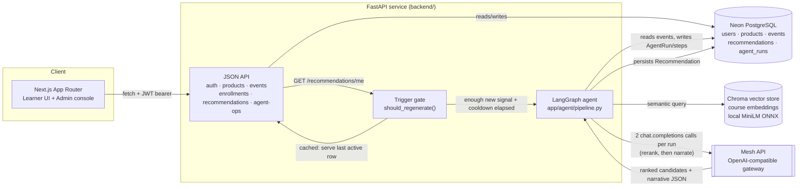
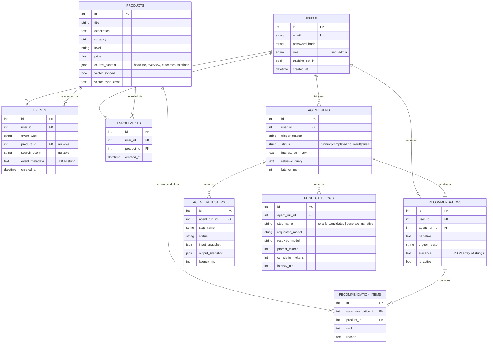
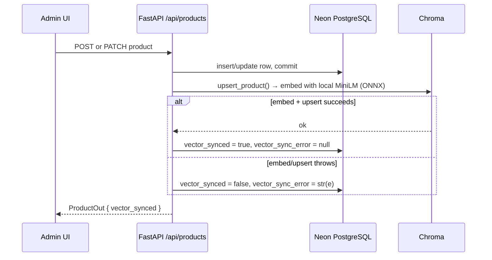
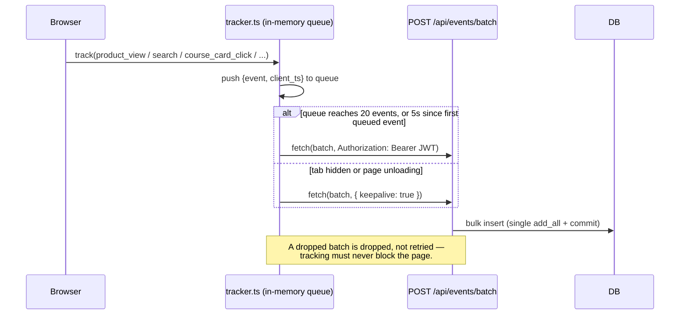
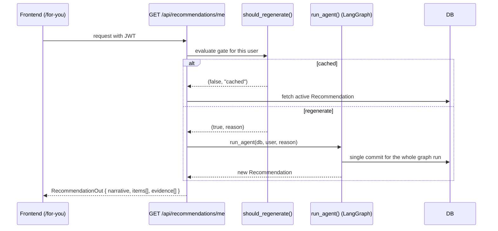
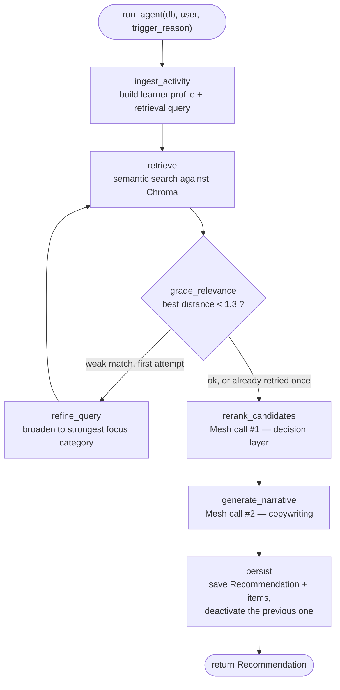
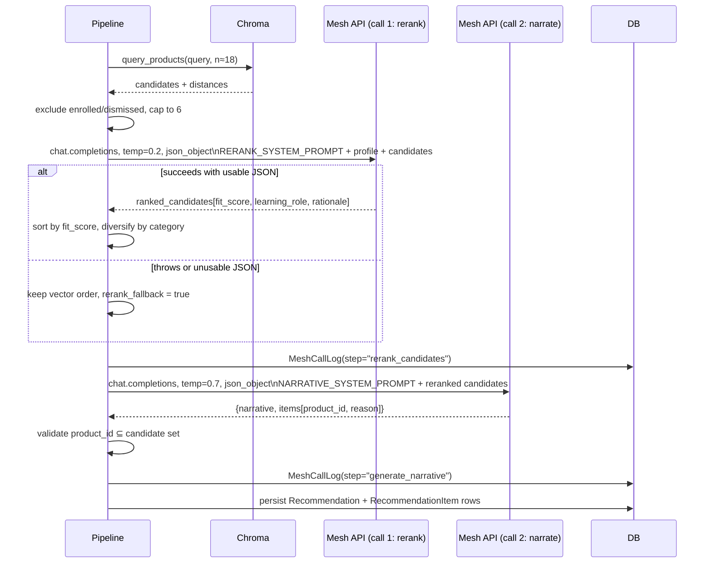
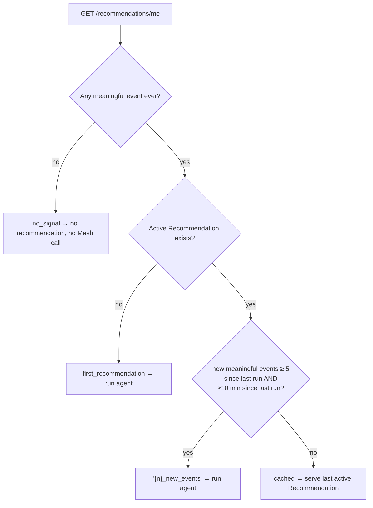

# Growise — Project Documentation

**A course marketplace where a backend agent watches how you browse, retrieves matching courses from a
vector store, and writes a short, grounded, persuasive recommendation — not a generic "related products"
list.**

Built for the SmartReco hackathon challenge.

---

## Contents

1. [Overview](#1-overview)
2. [System architecture](#2-system-architecture)
3. [Schema design](#3-schema-design)
4. [Core flows](#4-core-flows)
5. [The recommendation agent](#5-the-recommendation-agent)
6. [Mesh API integration](#6-mesh-api-integration)
7. [Trigger efficiency (when the agent runs)](#7-trigger-efficiency-when-the-agent-runs)
8. [Observability](#8-observability)
9. [Frontend architecture](#9-frontend-architecture)
10. [API reference](#10-api-reference)
11. [Setup](#11-setup)
12. [Notable design decisions](#12-notable-design-decisions)

---

## 1. Overview

Growise is two separate services:

| Service | Stack | Role |
|---|---|---|
| `frontend/` | Next.js 16 (App Router) + React 19 + Tailwind | Server-rendered UI. A thin JSON API consumer — no business logic lives here. |
| `backend/` | FastAPI + SQLAlchemy + Chroma + LangGraph | Auth, catalog, behavioral events, and the recommendation agent. |

They're split on purpose: the hackathon spec requires the agent/backend logic to live in a Python web
framework, so the frontend never touches recommendation logic directly — it only calls
`GET /api/recommendations/me`. Auth is JWT bearer tokens rather than cookies, since the two run on
different origins in dev (`:3000` and `:8000`).

The product loop is:

1. A learner browses courses. The frontend batches what they do (views, searches, clicks, dwell time) and
   ships it to the backend without blocking the page.
2. Once there's enough new signal, a LangGraph agent turns that activity into a short learner profile,
   retrieves grounded candidates from a vector store, has **Mesh API** re-rank and then narrate them, and
   persists the result.
3. The frontend renders that recommendation on the "For You" page, with the evidence (dwell time, search
   terms, focus category) that produced it.
4. An admin can inspect every step of every agent run — including both Mesh calls — on `/admin/traces`.

---

## 2. System architecture



**Frontend** (`frontend/src/`) — App Router pages for the marketplace (`/`, `/courses`, `/courses/[id]`),
learner areas (`/for-you`, `/my-learning`), auth (`/login`, `/signup`), and an admin console
(`/admin/catalog-health`, `/admin/events`, `/admin/traces`, `/admin/agent-ops`, `/admin/courses`). All data
access goes through `frontend/src/lib/api.ts`, a typed `fetch` wrapper.

**FastAPI backend** (`backend/app/`) — six routers (`auth`, `products`, `events`, `enrollments`,
`recommendations`, `agent_ops`), a service layer (`product_service.py`) that owns the catalog's dual-write,
and the agent package (`agent/pipeline.py`, `agent/trigger.py`).

**Neon PostgreSQL** — the system of record: users, catalog, behavioral events, enrollments,
recommendations, and full agent-run telemetry. The deployed `DATABASE_URL` points SQLAlchemy to Neon;
`psycopg2` provides the PostgreSQL driver and Neon uses an SSL-enabled connection string.

**Chroma** — a local, persistent vector store (`chroma_data/`) holding one embedded document per course.
Embeddings are computed with Chroma's bundled `all-MiniLM-L6-v2` ONNX model — no GPU, no external embedding
API, no quota.

**Mesh API** — an OpenAI-compatible LLM gateway (`https://api.meshapi.ai/v1`), reached through
`langchain_openai.ChatOpenAI`. Used twice per agent run: once to **re-rank** retrieved candidates, once to
**write the narrative**. Detailed in [§6](#6-mesh-api-integration).

---

## 3. Schema design



Key design choices baked into this schema:

- **Recommendations are versioned, not overwritten.** `Recommendation.is_active` — a new run flips the
  previous active row to `false` and inserts a new one rather than mutating it, so recommendation history
  survives for analytics and Agent Ops replay.
- **Every agent run is durable**, independent of whether it produced a recommendation. `AgentRun.status`
  distinguishes `completed` (persisted a recommendation), `no_result` (ran fine, nothing to recommend), and
  `failed` (exception, with `error_message`).
- **Two levels of telemetry per run**: `AgentRunStep` captures every LangGraph node (with input/output
  snapshots and latency); `MeshCallLog` captures only the two calls that actually leave the process, with
  token counts and resolved model. This separation is what makes `/admin/traces` and `/admin/agent-ops`
  possible without re-deriving anything.
- **`Product.vector_synced` / `vector_sync_error`** make the dual-write's real state visible instead of
  assuming the SQL write implies the vector write succeeded — see [§4.2](#42-catalog-dual-write).
- **`ensure_schema()`** (`backend/app/database.py`) applies additive `ALTER TABLE` statements for columns
  introduced after the initial `create_all()` (`course_content`, `vector_sync_error`,
  `recommendations.agent_run_id`), so existing databases from earlier schema versions remain compatible
  without a migration tool.

---

## 4. Core flows

### 4.1 Auth

JWT bearer tokens (`app/auth.py`), not cookies — the two services run on different origins in dev, and
tokens travel identically over `fetch` and `fetch(..., keepalive: true)`, which cookies with
`sendBeacon`-style unload flushes cannot guarantee. `create_access_token` embeds `sub` (user id) and `role`;
`get_current_admin` is a second dependency layered on `get_current_user` for the six `/api/admin/*` routes.

### 4.2 Catalog dual-write



`ProductService` (`backend/app/services/product_service.py`) always writes SQL first, then attempts the
vector write in the same request. A vector failure never loses the SQL row or silently pretends the course
is searchable — it's marked `vector_synced=false` so `/admin/catalog-health` surfaces it and
`POST /admin/agent-ops/catalog-health/retry` can resync it later (`resync_pending_products`).

### 4.3 Behavioral tracking



`frontend/src/lib/tracker.ts` never fires per-event requests. High-frequency signals (scroll, mousemove)
are deliberately not tracked raw; time-on-page is computed once on unmount/hide, not sampled continuously.
Users with `tracking_opt_in = false` never get events queued client-side, and the backend accepts but
discards their batches (`events.py: ingest_events`).

### 4.4 End-to-end recommendation request



---

## 5. The recommendation agent

`backend/app/agent/pipeline.py` builds one compiled LangGraph `StateGraph` per request. The graph:



Every node is wrapped by `_trace_node`, which records an `AgentRunStep` with a redacted input/output
snapshot and latency — no raw prompts or PII, just enough to replay the run's shape in the admin UI. All
writes across the whole graph are staged with `db.add()` and committed exactly once in `run_agent`,
because committing per step measured at ~1s per round trip against the deployed Neon PostgreSQL instance — roughly
20 of a 22-second run.

**`ingest_activity`** — Pulls the user's last 180 candidate events (capped by `PROFILE_EVENT_LIMIT`),
folds adjacent view/click events on the same course within a 10-minute window into one "course-opening
session" (`COURSE_SESSION_WINDOW_SECONDS`), and scores interest per category and per course:

- Open-type events (`product_view`, `course_card_click`, `search_result_click`, `recommendation_click`)
  are weighted 1.0–1.5.
- `enroll_click` is weighted 4.0 — enrollment is the strongest possible signal.
- Dwell time (`time_on_page`) only counts once it crosses `DWELL_QUALIFYING_SECONDS = 20`, and its points
  scale up to a cap of `DWELL_MAX_WEIGHT = 4` so a single long session can't dominate the profile.
- Every event is discounted by recency: full weight inside a day, 0.8× within a week, 0.55× within a
  month, 0.35× beyond that.

The node outputs a natural-language `interest_summary`, a short `evidence` list (used verbatim in the
learner-facing UI), a `learner_profile` dict (focus categories, engaged courses, search intent, enrolled
and dismissed context), and a retrieval `query` string built from the strongest signals.

**`retrieve`** — Runs `vector_store.query_products(query, n_results=...)` against Chroma. It over-fetches
(`RETRIEVAL_BUFFER = 12` beyond the target of 6) so that hard-filtering out enrolled and recently-dismissed
courses still leaves a usable candidate set, rather than filtering post-hoc and running dry.

**`grade_relevance`** — A cheap heuristic gate, not a Mesh call: if the closest retrieved candidate's
vector distance is under `RELEVANCE_DISTANCE_THRESHOLD = 1.3`, retrieval is accepted. Otherwise the graph
loops back through `refine_query` **once** (`retry_count >= 1` forces acceptance on the second pass) —
bounded, so a genuinely thin catalog match can't loop forever.

**`refine_query`** — Broadens the query to the single strongest verified focus category (e.g. "next-step
Data Science courses") rather than reusing generic boilerplate words from the first query.

**`rerank_candidates`** and **`generate_narrative`** are the two Mesh API calls — see [§6](#6-mesh-api-integration).

**`persist`** — Deactivates the user's previous `Recommendation` (`is_active=False`) and inserts the new
one with its `RecommendationItem` rows, only if the narrative step actually returned items.

---

## 6. Mesh API integration

Mesh API is used as an **OpenAI-compatible chat completions gateway**, accessed exclusively through
`get_mesh_llm()` in `backend/app/mesh_client.py`:

```python
def get_mesh_llm(temperature: float = 0.7) -> ChatOpenAI:
    return ChatOpenAI(
        base_url=settings.mesh_base_url,   # https://api.meshapi.ai/v1
        api_key=settings.mesh_api_key,
        model=settings.mesh_model,          # openai/gpt-4o-mini
        temperature=temperature,
    )
```

Routing through LangChain's `ChatOpenAI` (rather than the raw `openai` SDK) rather than a bespoke Mesh
client buys two things: every call is automatically traced end-to-end in LangSmith when
`LANGCHAIN_TRACING_V2=true` is set, and both Mesh call sites can force strict JSON with
`.bind(response_format={"type": "json_object"})`.

The agent calls Mesh **twice per run**, for two distinct jobs — a decision-layer re-rank, then a
copywriting pass over the result:

### 6.1 Call #1 — `rerank_candidates` (the decision layer)

Vector search finds *semantically similar* courses; it has no notion of "already enrolled in the
foundation," "this learner just dismissed something adjacent," or "prefer a coherent next step over three
near-duplicates." That judgment is delegated to Mesh as a structured re-ranking pass, temperature `0.2`
(deterministic, not creative):

```
RERANK_SYSTEM_PROMPT:
"You are the decision layer for Growise course recommendations. Score only the
eligible candidate courses against the supplied learner profile. Be conservative: use explicit browsing
evidence, search intent, and enrolled-course context, not guessed career goals. An enrolled course is
learning context only and is never an eligible candidate. Prefer a coherent next step, deeper practice,
or a useful adjacent capability over duplicate foundations. Courses the learner dismissed are also
ineligible; do not try to reintroduce them.

Respond with ONLY a JSON object of this exact shape, no markdown fences:
{"ranked_candidates": [{"product_id": <int>, "fit_score": <0-100>,
  "learning_role": "deepen|next_step|adjacent", "rationale": "short evidence-grounded rationale"}]}

Return every eligible candidate exactly once, highest fit first."
```

The user message carries the `interest_summary`, the evidence chips, enrolled and dismissed courses (for
context, explicitly marked ineligible), and up to `RETRIEVE_N = 6` candidates with compact course facts
(title, category, level, tags, a trimmed description, and top outcomes).

What Growise does with the response:

- Parses `ranked_candidates`, clamps `fit_score` into `[0, 100]` (`_fit_score`), and normalizes
  `learning_role` to one of `deepen | next_step | adjacent` (defaulting to `next_step` if the model
  returns something else).
- Re-sorts candidates by `(-fit_score, original_vector_rank)` — Mesh's fit score is the primary order,
  vector rank only breaks ties.
- Runs `_diversify_candidates`: pulls the first course from each distinct category to the front, pushing
  repeats of an already-seen category later, so three near-identical picks don't crowd out a useful
  adjacent one.
- **Every product ID in the response is validated against the actual retrieved set** — Mesh selects an
  order and a rationale, never a course. It cannot introduce a course that wasn't retrieved.

**Fallback path**: if the Mesh call throws, or returns JSON that doesn't parse into anything usable, the
pipeline does *not* fail the run — it keeps the original vector-search order, marks `rerank_fallback=true`,
and continues into narrative generation with `learning_role="vector match"` /
`rationale="Mesh reranking unavailable."`. The admin Traces UI reads this flag directly
(`frontend/src/app/admin/traces/page.tsx`) and shows *"Vector order was retained because the Mesh selection
pass was unavailable"* instead of pretending a re-rank happened.

### 6.2 Call #2 — `generate_narrative` (the copywriter)

The second call, temperature `0.7`, takes the **already-reranked** candidates — including their `fit_score`,
`learning_role`, and `rationale` from call #1 — plus the fuller curriculum context (headline, overview,
outcomes) that wasn't sent to the cheaper rerank call, and writes the learner-facing copy:

```
NARRATIVE_SYSTEM_PROMPT:
"You are the Growise recommendation agent for an online course marketplace. You write short, honest,
specific next-step recommendations grounded strictly in the learner profile and the real candidate
courses provided to you. Never invent courses, facts, goals, or numbers. Avoid generic marketing fluff.
Treat enrolled courses as learning context [...] Reference explicit learner evidence or a concrete
relationship to an enrolled foundation in each reason.

Respond with ONLY a JSON object of this exact shape, no markdown fences:
{"narrative": "2-3 sentence recommendation intro, written to the user in second person",
 "items": [{"product_id": <int>, "reason": "one sentence, specific, references their behavior"}]}

Pick at most 3 courses from the candidates [...] return fewer than three if the candidate set does not
support a distinct next step."
```

Again, every `product_id` in the response is checked against the candidate set before being persisted
(`valid_ids = {p.id for p in candidates}`) — the narrative model can decline to use a candidate, or write
about fewer than three, but it cannot fabricate a course. Unlike the rerank step, a failure here is **not**
swallowed — `generate_narrative` re-raises, which fails the whole `AgentRun` (`status="failed"`), because a
recommendation with no narrative has nothing to show the learner.

### 6.3 Why two calls instead of one

| | Call #1: `rerank_candidates` | Call #2: `generate_narrative` |
|---|---|---|
| Temperature | 0.2 — deterministic ranking | 0.7 — natural prose |
| Input | Compact facts (title/category/level/tags/short description) | Full curriculum (headline, overview, outcomes) for only the courses that survived reranking |
| Output | Structured scores + roles, no prose | 2–3 sentence narrative + one reason per pick |
| Failure mode | Falls back to vector order, run continues | Fails the whole run |
| Purpose | Decide **which** courses and **why**, cheaply | Decide **how to say it**, well |

Splitting the job keeps the expensive, larger-context call (full curriculum text, creative prose) to
exactly the up-to-3 courses that made the cut, instead of paying for full curriculum context on all 6
candidates in a single combined call.

### 6.4 Observability into Mesh calls

Every Mesh call — success or failure — writes one `MeshCallLog` row (`backend/app/models.py`) with
`step_name`, `requested_model` / `resolved_model`, `prompt_tokens` / `completion_tokens` / `total_tokens`,
`latency_ms`, and `response_metadata` (finish reason, system fingerprint, service tier where the provider
returns them). `_mesh_response_details()` normalizes LangChain's provider metadata into these stable fields
regardless of which upstream model Mesh actually routed to.



This is also what powers `/admin/agent-ops` (daily tokens used, active models, requests routed, average
and p95 latency) and the per-run **Reranking** card on `/admin/traces`, which shows exactly which
candidates Mesh picked versus discarded and why.

---

## 7. Trigger efficiency (when the agent runs)

The agent is never called on every event — that would mean an LLM round trip (two Mesh calls) per page
view. `should_regenerate()` (`backend/app/agent/trigger.py`) gates on real signal:



`MEANINGFUL_EVENT_TYPES` excludes short bounces: a `time_on_page` event only counts once its dwell exceeds
20 seconds (`is_meaningful_event`), evaluated in Python rather than SQL because the threshold check needs
the parsed JSON metadata. The thresholds are configurable via `.env`
(`recommendation_min_new_events`, default `5`; `recommendation_cooldown_minutes`, default `10`).

The explicit **Refresh** button (`POST /api/recommendations/refresh`) bypasses the event-count/cooldown
gate — it's a deliberate user action — but still requires `reason != "no_signal"`, i.e. at least some
activity must exist before a manual refresh is allowed to spend a Mesh call.

---

## 8. Observability

Beyond `MeshCallLog`, every graph node writes an `AgentRunStep` with a redacted state snapshot
(`_state_snapshot`) — trigger reason, interest summary, evidence, retrieved/reranked candidates (rounded
distances, fit scores, rationale), the `rerank_fallback` flag, and final recommended items. This is the
backbone of two admin pages:

- **`/admin/traces`** — pick an `AgentRun`, see every step's timing and I/O, with a dedicated Reranking
  card that separates the courses Mesh actually picked from the alternatives it considered, and calls out
  when reranking fell back to vector order.
- **`/admin/agent-ops`** — fleet-level dashboard: tokens used today, active models, requests routed,
  average/p95 Mesh latency, agent runs and events today, recommendation click-through and enrollment rate.
- **`/admin/catalog-health`** — dual-write status across the catalog (`total / synced / pending / failed`),
  with a one-click resync for anything that failed.
- **LangSmith** — because Mesh calls go through `langchain_openai.ChatOpenAI`, setting
  `LANGCHAIN_TRACING_V2=true` / `LANGCHAIN_API_KEY` / `LANGCHAIN_PROJECT` traces the entire LangGraph run —
  every node, both Mesh calls, token counts — in LangSmith with no code changes.

---

## 9. Frontend architecture

```
frontend/src/
├── app/                      # Next.js App Router — one folder per route
│   ├── page.tsx              # Landing page
│   ├── courses/, courses/[id]/   # Catalog browse + detail
│   ├── for-you/               # The recommendation surface
│   ├── my-learning/           # Enrolled courses
│   ├── login/, signup/
│   └── admin/                 # catalog-health, courses, events, traces, agent-ops
├── components/                # course-card, enroll-panel, navbar, nav-search, home/*, admin-*
└── lib/
    ├── api.ts                 # Typed fetch client, one namespace per router (authApi, productsApi, ...)
    ├── auth-context.tsx        # JWT storage + current user
    ├── tracker.ts              # Behavioral event batching (§4.3)
    ├── recommendation-evidence.ts
    └── types.ts
```

All server communication is centralized in `lib/api.ts`: a single `request<T>()` wrapper attaches the JWT
bearer header and normalizes error bodies into `ApiError`, and each namespace (`authApi`, `productsApi`,
`eventsApi`, `enrollmentsApi`, `recommendationsApi`, `agentOpsApi`) exposes typed methods that map 1:1 onto
backend routes — nothing in the UI constructs a fetch URL by hand.

---

## 10. API reference

| Method | Path | Auth | Purpose |
|---|---|---|---|
| POST | `/api/auth/signup` | — | Create user, returns JWT |
| POST | `/api/auth/login` | — | Returns JWT |
| GET | `/api/auth/me` | user | Current user profile |
| GET | `/api/products` | — | Filterable catalog list (category, level, price, text query) |
| GET | `/api/products/categories` | — | Distinct categories |
| GET | `/api/products/{id}` | — | Single course |
| POST / PATCH / DELETE | `/api/products[/{id}]` | admin | Catalog writes — dual-write to Chroma |
| GET | `/api/events/me` | user | Recent events (for the "Your Signal" UI) |
| POST | `/api/events/batch` | user | Ingest a batch of behavioral events |
| GET | `/api/enrollments/me` | user | Learner's enrollments |
| POST | `/api/enrollments` | user | Enroll (idempotent) |
| GET | `/api/recommendations/me` | user | Cached or freshly-generated recommendation |
| POST | `/api/recommendations/refresh` | user | Force a regeneration (still requires prior activity) |
| GET | `/api/admin/agent-ops/overview` | admin | Fleet metrics (tokens, latency, CTR) |
| GET | `/api/admin/agent-ops/events` | admin | Filterable live event feed |
| GET | `/api/admin/agent-ops/runs`, `/runs/{id}` | admin | Agent run list / full trace with steps + Mesh calls |
| GET / POST | `/api/admin/agent-ops/catalog-health[/retry]` | admin | Dual-write status + resync |
| GET | `/api/health` | — | Liveness check |

---

## 11. Setup

### Backend

```bash
cd backend
python3 -m venv venv && source venv/bin/activate
pip install -r requirements.txt
cp .env.example .env   # fill in MESH_API_KEY
python seed.py         # creates admin@growise.dev / AdminPass123 and seeds ~42 courses
uvicorn app.main:app --reload --port 8000
```

### Frontend

```bash
cd frontend
npm install
npm run dev   # http://localhost:3000, expects the backend on :8000 (see .env.local)
```

### Key configuration (`backend/app/config.py`)

| Setting | Default | Purpose |
|---|---|---|
| `DATABASE_URL` | Neon PostgreSQL URL with `sslmode=require` | Connection used by SQLAlchemy for application data |
| `chroma_persist_dir` | `./chroma_data` | Vector store location |
| `mesh_base_url` | `https://api.meshapi.ai/v1` | Mesh's OpenAI-compatible endpoint |
| `mesh_model` | `openai/gpt-4o-mini` | Model Mesh routes both calls to |
| `recommendation_min_new_events` | `5` | Trigger gate — see [§7](#7-trigger-efficiency-when-the-agent-runs) |
| `recommendation_cooldown_minutes` | `10` | Trigger gate cooldown |

---

## 12. Notable design decisions

- **Two Mesh calls, not one** — separating ranking (cheap, structured, deterministic) from narrative
  (expensive context, creative) keeps full curriculum text out of the ranking prompt and lets a rerank
  failure degrade gracefully instead of blocking the whole recommendation.
- **The agent can never invent a course** — both Mesh responses are validated against the actual
  retrieved/candidate set before anything touches the database; Mesh chooses order, role, and copy, never
  identity.
- **One commit per agent run**, not per step — a measured ~1s-per-round-trip cost against deployed Neon PostgreSQL
  made per-step commits the dominant cost of a run; all writes are staged and flushed once.
- **Recommendations are additive/versioned**, never overwritten in place, so both learners and admins can
  see what changed and why across runs.
- **Consent is explicit** — the signup checkbox maps directly to `tracking_opt_in`; opted-out users' events
  are accepted but never queued client-side, and the trigger gate never fires for them.
- **Dual-write status is observable, not assumed** — `vector_synced` / `vector_sync_error` on `Product`
  mean the admin UI shows the real state of the catalog's searchability, with a manual retry path.
